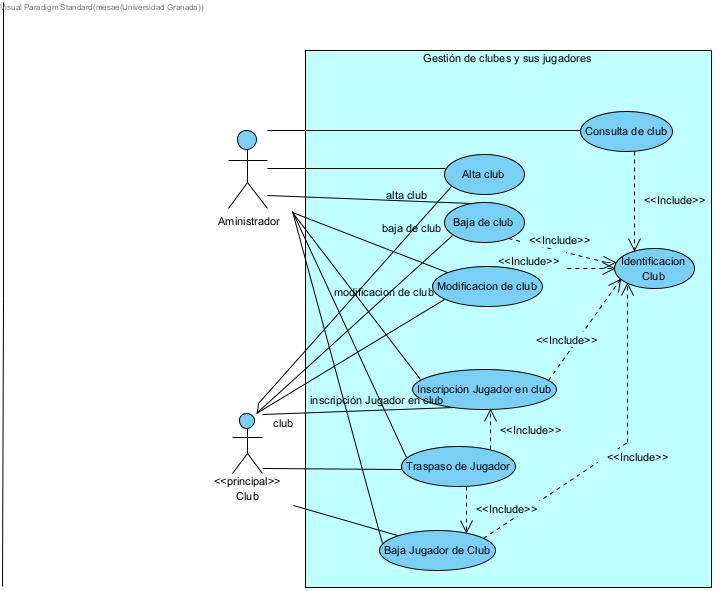
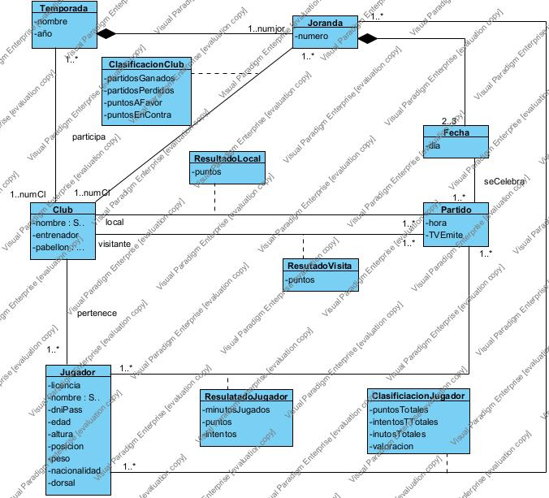
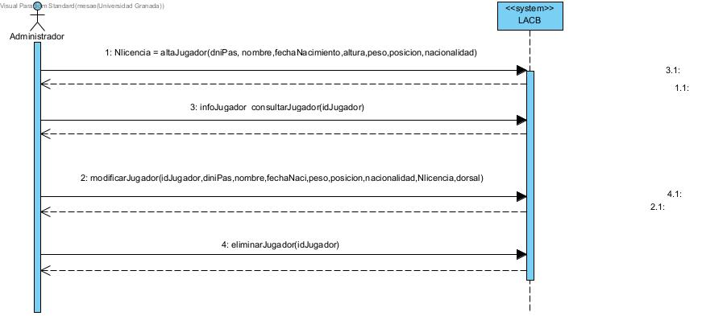
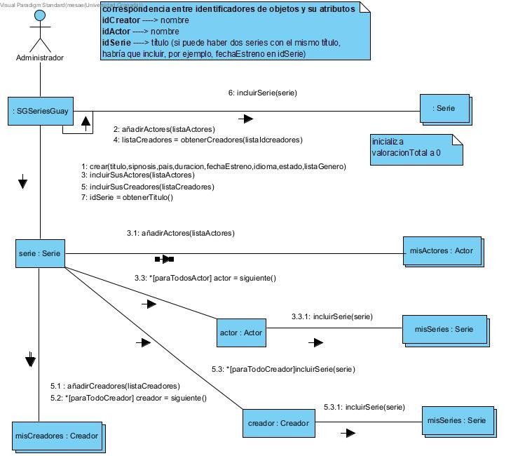

# Mi prática de Visual Paradigm

En este repositorio se presentann los diagramas UML correspondientes a la práctica:

## 1. Diagrama de Casos de Uso
Representa las funcionalidades del sistema y cómo interactúan los actores con él.

## 2. Modelo Conceptual (Diagrama de Clases)
Muestra las entidades principales del dominio y sus relaciones.

## 3. Diagrama de Secuencia
Describe la interacción entre objetos en un orden temporal específico.

)

## 4. Diagrama de Comunicación
Se centra en la organización estructural de los objetos que intercambian mensajes.

